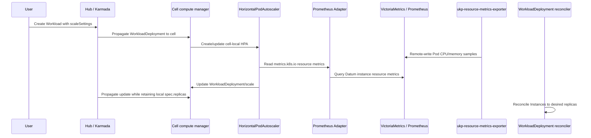

# HPA-based horizontal autoscaling for compute workloads

> Tracks [datum-cloud/enhancements#799](https://github.com/datum-cloud/enhancements/issues/799).

## Table of Contents

- [Summary](#summary)
- [What this enables for users](#what-this-enables-for-users)
- [End-to-end flow](#end-to-end-flow)
- [Design](#design)
  - [Scale target](#scale-target)
  - [HPA lifecycle](#hpa-lifecycle)
  - [Resource metrics](#resource-metrics)
  - [Status](#status)
- [Alternatives](#alternatives)
- [Failure modes](#failure-modes)
- [What gets built](#what-gets-built)
- [Decisions](#decisions)
- [Open questions](#open-questions)

---

## Summary

Compute workloads can describe autoscaling policy today, but replica count still
stays fixed at the minimum. This RFC makes that policy active by using the stock
Kubernetes `HorizontalPodAutoscaler` in each POP cell.

HPA writes desired replicas through the `WorkloadDeployment` scale subresource and
reads CPU/memory through the standard Resource Metrics API (`metrics.k8s.io`). The
runtime-specific work of turning Unikraft/ukpd measurements into Pod resource
metrics lives in `unikraft-provider`, not in Compute.

This design keeps the scaling decision local to the cell, reuses Kubernetes'
existing autoscaling behavior, and avoids a Compute-owned autoscaling loop.

## What this enables for users

A user can set `scaleSettings.minReplicas`, `scaleSettings.maxReplicas`, and CPU or
memory resource targets on a `Workload`. Each placed `WorkloadDeployment` then
scales independently in its own cell:

- idle workloads sit at their configured minimum;
- busy workloads scale up as CPU or memory crosses the target;
- quiet workloads scale back down inside the configured bounds;
- workload status shows the current autoscaling state without requiring users to
  inspect the HPA directly.

Autoscaling is explicit. Setting min/max without metrics remains fixed-size policy;
Compute does not invent a default CPU target.

## End-to-end flow

The decided implementation is: Workload policy -> cell-local HPA ->
`WorkloadDeployment/scale` -> normal Instance reconciliation. Metrics flow through
the existing telemetry path and a Resource Metrics API adapter.



## Design

### Scale target

`WorkloadDeployment` becomes the HPA scale target. It exposes `/scale` with:

- `.spec.replicas` as the desired replica field HPA writes;
- `.status.replicas` as the current replica count HPA reads;
- `.status.selector` as the Pod selector HPA uses to find the backing Pods.

The selector is based on the stable WorkloadDeployment UID label used by Compute's
Instance/Pod control path:

```text
compute.datumapis.com/workload-deployment-uid=<workloaddeployment uid>
```

`WorkloadDeploymentReconciler` treats `.spec.replicas` as the effective desired
count when it is set and falls back to `scaleSettings.minReplicas` when it is unset.
Deletion still drives the effective desired count to zero.

### HPA lifecycle

The cell compute manager creates one `autoscaling/v2.HorizontalPodAutoscaler` per
autoscaled `WorkloadDeployment`. The HPA is local to the cell and is not propagated
by Karmada.

Compute creates an HPA only when autoscaling is actually configured:

- `scaleSettings.maxReplicas` is set;
- `scaleSettings.metrics` is non-empty.

The HPA's `minReplicas`, `maxReplicas`, scale target, and metrics are reconciled
from `scaleSettings`. CPU and memory Compute resource metrics map to HPA
`Resource` metrics so `AverageUtilization`, `AverageValue`, and `Value` keep their
Kubernetes meanings.

### Resource metrics

kraftlet does not expose the kubelet metrics endpoints that `metrics-server`
expects. The implemented path therefore does not ask metrics-server to scrape
kraftlet. Instead:

1. `unikraft-provider` runs `ukp-telemetry` on Unikraft runtime nodes.
2. A node-local `ukp-resource-metrics-exporter` sidecar queries ukpd's local control API on `127.0.0.1:45232`.
3. The exporter joins ukpd instances to provider Pods by guest IP.
4. The exporter emits Datum-native Prometheus metrics.
5. The OpenTelemetry Collector remote-writes those samples to VictoriaMetrics/Prometheus.
6. Compute's Prometheus Adapter component serves `metrics.k8s.io` resource metrics from those samples.

The required series are:

```text
datum_compute_instance_cpu_usage_seconds_total{namespace,pod,container,node,...}
datum_compute_instance_memory_working_set_bytes{namespace,pod,container,node,...}
```

Required labels:

- `namespace`: provider Pod namespace.
- `pod`: provider Pod name.
- `container`: provider Pod container name, or a stable synthetic name.
- `node`: kraftlet virtual node from the Pod spec.

Additional labels such as `runtime_node` and `ukp_instance_uuid` are useful for
debugging but are not part of the Resource Metrics API mapping.

CPU is a cumulative seconds counter converted from ukpd `cpu_time_ms`.
Memory is a bytes gauge using ukpd `rss_bytes` as the closest available working-set approximation.

### Status

HPA owns its native conditions and last-computed metrics. Compute mirrors the useful
summary onto `WorkloadDeployment.status` so users can understand autoscaling without
looking up the generated HPA object.

The mirrored status should answer:

- whether autoscaling is active;
- why scaling is blocked or limited;
- what desired replica count HPA last selected;
- what metric values HPA most recently observed.

## Alternatives

**Compute-owned autoscaling controller.** This would give Compute exact control over
new-instance handling, missing metrics, and status shape. Rejected for this path
because HPA already implements the core scaling loop and users expect standard HPA
semantics for CPU and memory.

**HPA in the hub cluster.** Rejected. It would put edge metrics and scaling decisions
back in the cross-cluster path. HPA must run in the same cell as the Instances it
scales.

**Metrics-server scraping kraftlet.** Rejected for current Unikraft workloads because
kraftlet does not serve the kubelet metrics endpoints metrics-server expects.

**A Compute metrics adapter that queries ukpd directly.** Rejected. It would make
Compute understand Unikraft topology, ukpd credentials, and instance identity. The
provider already owns that node-local context, so it should produce Kubernetes-shaped
resource metrics for Compute to consume generically.

**KEDA or HPA external metrics for CPU/memory.** Rejected for this use case. CPU and
memory should be HPA `Resource` metrics so `averageUtilization` remains percentage of
Pod requests. External/custom metrics are still possible future signals for other
autoscaling modes.

## Failure modes

**Karmada retention is wrong.** The hub can silently overwrite a cell-local HPA write
to `.spec.replicas`. Retention must be validated against real propagation resyncs,
not only a single local write.

**Resource Metrics API is unavailable.** If Prometheus Adapter or its backing
VictoriaMetrics/Prometheus query fails, HPA treats metrics as missing and holds the
current replica count rather than guessing.

**Exporter cannot join ukpd instances to Pods.** Pods without joined metrics are
missing from the HPA calculation. The exporter must fail closed for those Pods rather
than emitting samples with guessed identity.

**Metrics are stale.** The path has several intervals: ukpd sampling, exporter
scrape, remote-write, Prometheus Adapter relist/max-age, and HPA sync. If the total
lag is too high, scaling reacts late.

**Memory semantic is approximate.** ukpd provides `rss_bytes`; Compute exposes that
through the working-set metric name because it is the closest available signal. This
is acceptable for the first implementation but should be validated under load.

## What gets built

- `WorkloadDeployment` `/scale` support with `spec.replicas`, `status.replicas`,
  and `status.selector`.
- Reconciler logic that uses effective desired replicas from `/scale`.
- Karmada retain behavior for the member-owned desired replica field.
- A cell-local HPA reconciler for autoscaled `WorkloadDeployment` objects.
- HPA status mirroring onto `WorkloadDeployment.status`.
- A Prometheus Adapter component that serves `metrics.k8s.io` from Datum resource
  metrics in VictoriaMetrics/Prometheus.
- Provider-side `ukp-resource-metrics-exporter` and `ukp-telemetry` wiring in
  `unikraft-provider`.

Out of scope: scale-to-zero, non-CPU/memory signals, per-user dedicated instance
allocation, and replacing HPA's scaling algorithm.

## Decisions

- **Use stock HPA** for CPU/memory horizontal scaling.
- **Run HPA in each cell**, not in the hub.
- **Use `WorkloadDeployment/scale`** as the HPA target.
- **Retain only `spec.replicas` locally** during Karmada propagation.
- **Use HPA Resource metrics**, not custom/external metrics, for CPU and memory.
- **Keep runtime metrics production in `unikraft-provider`** through the
  node-local ukpd exporter.
- **Serve Resource Metrics API through Prometheus Adapter** backed by the existing
  VictoriaMetrics/Prometheus telemetry path.

## Open questions

1. Does the full exporter -> VictoriaMetrics/Prometheus -> Prometheus Adapter -> HPA
   path meet the latency target in a real cell?
2. Is ukpd `rss_bytes` good enough for memory-based autoscaling, or do we need a
   different memory signal later?
3. Should `--horizontal-pod-autoscaler-sync-period` be adjusted or do we expect the
   default to work well for us?
4. How should scale-to-zero interact with normal HPA-driven scaling?
