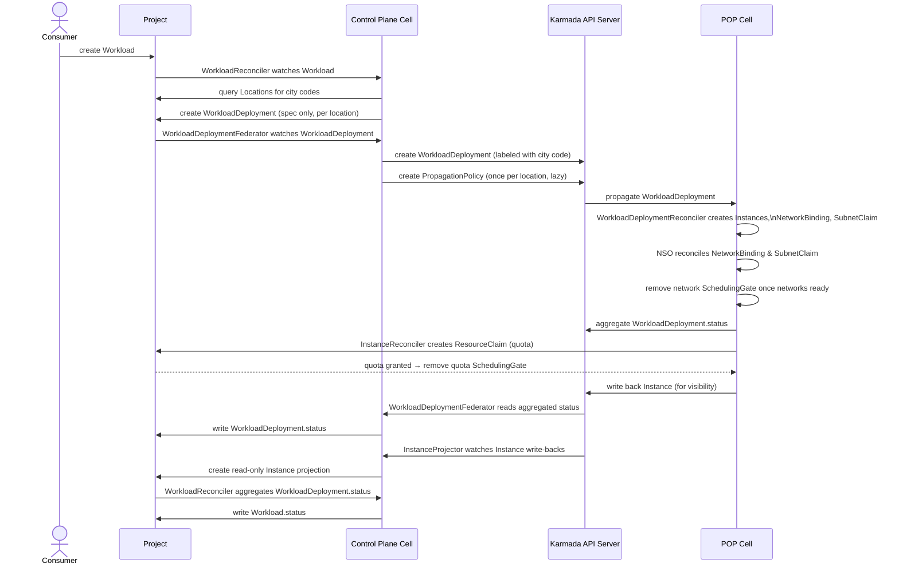
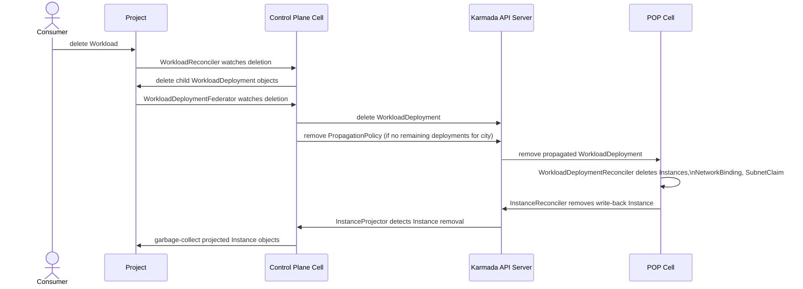
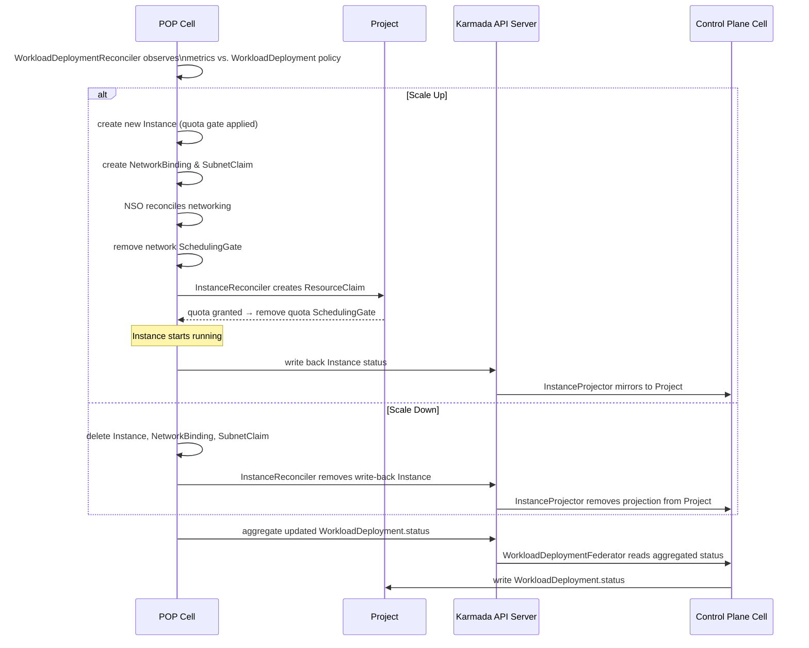

# Federated Deployment Scheduling

**Issue:** [#85 — Define integration strategy with federated control plane for workload deployment scheduling](https://github.com/datum-cloud/compute/issues/85)
**Status:** Draft

---

## Summary

When you deploy a workload to a city location, Datum needs to route it to the right physical site and keep you informed of its status. Today that routing logic lives in a single place; this enhancement distributes it across a federation of regional clusters using Karmada.

From a user perspective, nothing changes — you still specify city codes, and your workloads, deployments, and instances appear exactly where you'd expect them. Behind the scenes, a dedicated federation layer takes over scheduling, so deployments reach their target locations faster, scale decisions happen locally at each site without depending on a central coordinator, and the platform remains operational even when parts of the control plane are temporarily unavailable.

---

## Terminology

- **Project** — An isolated tenant environment where a user's resources (Workloads, Deployments, Instances) are created and visible.
- **Workload** — A user-defined application specification, including the container image, resource requirements, and target city locations.
- **WorkloadDeployment** — A per-city deployment intent derived from a Workload. Tracks how many replicas should be running and reports their current status.
- **Instance** — A single running replica of a WorkloadDeployment at a specific POP Cell.
- **POP Cell** — A physical point-of-presence site (e.g., DFW-01) where Instances actually run. Each city code maps to one POP Cell.
- **Control Plane Cell** — The central compute operator that coordinates between Projects and the Karmada federation layer.
- **Karmada** — An open-source multi-cluster orchestration system that distributes workloads across registered member clusters (POP Cells) and aggregates their status.
- **Karmada API Server** — The central federation API server managed by Karmada. WorkloadDeployments are written here so Karmada can propagate them to the correct POP Cell.
- **PropagationPolicy** — A Karmada resource that defines which clusters a resource should be sent to, based on label selectors. One is created per canonical location per project namespace.
- **Management Cluster** — The central Kubernetes cluster that hosts shared platform infrastructure.
- **NSO** — Network Services Operator — runs in each POP Cell to provision networking resources (NetworkBinding, SubnetClaim, Subnet) needed by Instances.
- **Milo** — Datum's shared platform library. Provides utilities like namespace mapping and multi-tenant client strategies used across services.
- **Scheduling Gate** — A hold placed on an Instance that prevents it from running until a specific condition is met (e.g., network ready, quota granted).

---

## Overview

The compute service must be adapted to work with the Karmada-based federated control plane
that replaces the single-platform-API-server MVP architecture. This document defines:

- Which control plane each resource lives in
- How the compute operator's topology changes
- How `WorkloadDeploymentScheduler` is replaced by Karmada propagation
- How `Instance` information is surfaced back to the user's project

### Design Constraints

- The consumer-facing `Workload` and `WorkloadDeployment` API surface does not change.
- Karmada unavailability is an internal infrastructure concern — no user-visible conditions.
- Multi-cell-per-city is deferred; each city code maps to exactly one Karmada member cluster at launch.

---

## Control Plane Topology

```
┌─────────────────────────────────────────────────────────┐
│  Project (one per project, discovered via Milo)         │
│                                                         │
│   Workload (consumer write)                             │
│   WorkloadDeployment (spec by operator, status by op.)  │
│   Instance (read-only projection by InstanceProjector)  │
└───────────────────┬─────────────────────────────────────┘
                    │ read Workload
                    │ write WorkloadDeployment spec + status
                    │ write Instance projection
                    │
┌───────────────────▼─────────────────────────────────────┐
│  Control Plane Cell (compute operator)                  │
│                                                         │
│   WorkloadReconciler           ← watches projects       │
│   WorkloadDeploymentFederator  ← syncs to Karmada       │
│   InstanceProjector            ← mirrors to projects    │
└───────────────────┬─────────────────────────────────────┘
                    │ write WorkloadDeployment + PropagationPolicy
                    │ read Instance (written back by POP cell)
                    │ write Instance projection to project
                    │
┌───────────────────▼─────────────────────────────────────┐
│  Karmada Federation API Server                          │
│                                                         │
│   WorkloadDeployment (propagated to POP cells)          │
│   PropagationPolicy (one per location per namespace)    │
│   Instance (written back by POP cell for visibility)    │
│   Cluster objects (one per POP cell, labeled by city)   │
└───────────────────┬─────────────────────────────────────┘
                    │ Karmada propagates WorkloadDeployment
                    │ POP cell writes Instance back
                    │
┌───────────────────▼─────────────────────────────────────┐
│  POP Cell (e.g., DFW-01)  [member cluster in Karmada]   │
│                                                         │
│   WorkloadDeployment (propagated by Karmada)            │
│   Instance (created locally)                            │
│   NetworkBinding / SubnetClaim (created locally)        │
│                                                         │
│   WorkloadDeploymentReconciler  ← creates Instances,    │
│                                   NetworkBinding,       │
│                                   SubnetClaim, gates    │
│   InstanceReconciler            ← quota, status,        │
│                                   write-back to Karmada │
│   NSO controllers               ← NetworkBinding,       │
│                                   SubnetClaim, Subnet   │
└─────────────────────────────────────────────────────────┘
```

---

## Resource Locations

| Resource | Lives In | Written By |
|---|---|---|
| `Workload` | Project | Consumer |
| `WorkloadDeployment` (consumer-facing) | Project | `WorkloadReconciler` (spec), `WorkloadDeploymentFederator` (status) |
| `WorkloadDeployment` (federation intent) | Karmada API Server | `WorkloadDeploymentFederator` |
| `PropagationPolicy` | Karmada API Server | `WorkloadDeploymentFederator` (one per location per namespace, lazy) |
| `Instance` (write-back) | Karmada API Server | `InstanceReconciler` (POP cell) |
| `Instance` (local execution) | POP Cell | `WorkloadDeploymentReconciler` (POP cell) |
| `Instance` (projection) | Project | `InstanceProjector` |
| `Location` | Project | `network-services-operator` |
| `NetworkBinding` | POP Cell | `WorkloadDeploymentReconciler`, reconciled by NSO (POP cell) |
| `SubnetClaim` | POP Cell | `WorkloadDeploymentReconciler`, reconciled by NSO (POP cell) |
| `ResourceClaim` (quota) | Project | `InstanceReconciler` (POP cell) |

---

## Control Flow

### Creation Path



### Deletion Path



---

## Instance Visibility

`Instance` objects must remain visible in the project because they are part of the consumer-facing API surface (network IPs, readiness conditions, etc.).

Since instances are created locally in POP cells, the `InstanceReconciler` writes a corresponding `Instance` object to the Karmada API Server after each status update. This uses the `MappedNamespaceResourceStrategy` (promoted into Milo as part of this work), applying the `ns-<project-namespace-uid>` namespace convention and the `meta.datumapis.com/*` label tracking used throughout the platform.

The `InstanceProjector` in the Control Plane Cell watches these Karmada-side `Instance` objects and mirrors them into the project as read-only projections.

No changes are required to `WorkloadDeployment.status` — it remains aggregate counts only.

### Projected Instance Fields

| Field | Source |
|---|---|
| `metadata.name` | Karmada-side Instance name |
| `metadata.ownerReferences` | Owned by the project `WorkloadDeployment` — cascading deletion |
| `spec` | Copied from Karmada-side Instance spec |
| `status` | Copied from Karmada-side Instance status |

---

## Operator Changes

### `WorkloadReconciler`

- **Unchanged**: Queries `Location` resources from the project; creates `WorkloadDeployment` objects in the project; aggregates `Workload.status`.

### `WorkloadDeploymentScheduler`

- **Removed entirely.** City code → cluster selection is handled by Karmada via `PropagationPolicy.placement.clusterAffinity.labelSelector`.

### New: `WorkloadDeploymentFederator`

A new controller in the Control Plane Cell:

- Watches `WorkloadDeployment` in every project (via multicluster-runtime).
- On create/update: upserts a corresponding `WorkloadDeployment` (labeled with city code) in the Karmada API Server.
- Creates a `PropagationPolicy` per location per project namespace lazily on first use.
- Reads aggregated `WorkloadDeployment.status` from the Karmada API Server and writes it to the project.
- On delete: removes the Karmada-side `WorkloadDeployment`. Removes the `PropagationPolicy` when no remaining deployment in the namespace targets that city code.

### `WorkloadDeploymentReconciler`

- **Runs in POP cell operators** — watches locally-propagated `WorkloadDeployment` objects.
- Unchanged behavior: creates `Instance`, `NetworkBinding`, `SubnetClaim` using existing stateful control logic.
- Manages `network` scheduling gate removal once NSO signals networks are ready.
- Updates local `WorkloadDeployment.status` with aggregate replica counts (Karmada aggregates this back natively).
- **Remove**: `WorkloadDeployment.status.location` (location is explicit in `spec.locationRef`).

### `InstanceReconciler`

- **Runs in POP cell operators** alongside `WorkloadDeploymentReconciler`.
- Manages `ResourceClaim` in the project for quota (unchanged).
- Manages `quota` scheduling gate removal once quota is granted.
- **New**: After updating local `Instance.status`, writes a corresponding `Instance` to the Karmada API Server for visibility.
- Requires two injected kubeconfigs at POP cell registration: project (quota) and Karmada API Server (write-back).

### New: `InstanceProjector`

A new controller in the Control Plane Cell:

- Watches `Instance` objects written back to the Karmada API Server.
- Creates/updates read-only `Instance` projections in the corresponding project, owned by the project `WorkloadDeployment`.
- Deletes projections when the Karmada-side `Instance` is removed.

---

## Auto Scaling

Auto scaling is not implemented at launch, but the federation architecture is designed to support it without the Control Plane Cell being in the critical path.

### Model

Scaling decisions run **locally in the POP cell**. The `WorkloadDeploymentReconciler` observes local instance metrics against the policy in the propagated `WorkloadDeployment`, creates or deletes `Instance` objects locally, and triggers `NetworkBinding`/`SubnetClaim` setup via local NSO — all without a round-trip to the Control Plane Cell.

**Quota is the single upstream dependency.** A new `Instance` is immediately stamped with the `quota` scheduling gate and a `ResourceClaim` is created in the project. The instance queues pending authorization and starts running as soon as the grant arrives. The scaling *decision* is never blocked — only the *execution* of new instances.



### Failure behavior

If the Control Plane Cell or Karmada is temporarily unavailable:

- Existing instances continue running unaffected.
- Local scaling decisions still happen — the `WorkloadDeploymentReconciler` continues to act on observed metrics.
- Scale-down is fully local and unaffected.
- Scale-up of new instances is gated on quota grants, which require the project to be reachable.

---

## Multicluster-Runtime Configuration

The Control Plane Cell operator connects to:

| Connection | Purpose | Config |
|---|---|---|
| Karmada Federation API Server | Write `WorkloadDeployment`, `PropagationPolicy`; read Instance write-backs | Static kubeconfig |
| Projects | Read `Workload`; write `WorkloadDeployment` spec/status, `Instance` projections | Milo provider (unchanged) |

POP cell operators connect to:

| Connection | Purpose | Config |
|---|---|---|
| Local POP cell | All local resource management | In-cluster config |
| Project | Write `ResourceClaim` for quota | Milo provider (unchanged) |
| Karmada Federation API Server | Write `Instance` objects for visibility | Static kubeconfig |

---

## Namespace Mapping

Resources written to the Karmada API Server follow the `ns-<upstream-namespace-uid>` convention established by the network-services-operator's `MappedNamespaceResourceStrategy`. This avoids collisions when multiple projects federate into a single Karmada API Server. Namespaces are auto-created on demand.

The `MappedNamespaceResourceStrategy` pattern will be promoted from NSO's `internal/downstreamclient/` into **Milo** as part of this work, making it available to both the compute service and POP cell operators without duplication.

`PropagationPolicy` objects live in the same namespace as the `WorkloadDeployment` objects they govern (`ns-<project-namespace-uid>`).

---

## Decisions

### Namespace Mapping Convention

Resources written to the Karmada API Server follow the `ns-<upstream-namespace-uid>` convention. Namespaces are auto-created on demand. `PropagationPolicy` resources live in the same namespace as the `WorkloadDeployment` objects they govern.

### Shared Downstream Client Library

The `MappedNamespaceResourceStrategy` pattern will be promoted from NSO's `internal/downstreamclient/` into **Milo** as part of this work. Both the Control Plane Cell operator and POP cell operators will depend on the Milo-hosted version.

### PropagationPolicy Scope

One `PropagationPolicy` per canonical location per project namespace, using a `labelSelector` to match all `WorkloadDeployment` objects labeled with `topology.datum.net/location: <location>`. Created lazily on first use, deleted when no deployment in the namespace targets that location.

### NSO in POP Cells

`network-services-operator` runs in each POP cell to reconcile `NetworkBinding`, `SubnetClaim`, and `Subnet` resources created locally by `WorkloadDeploymentReconciler`. This keeps all networking setup local to the POP cell, eliminating any dependency on the Control Plane Cell for network provisioning.

### Auto Scaling

Auto scaling decisions are local to the POP cell. Quota is the single upstream dependency — new instances queue with a `quota` scheduling gate and start as soon as the grant arrives. The Control Plane Cell is not in the critical path for scaling latency or availability.
